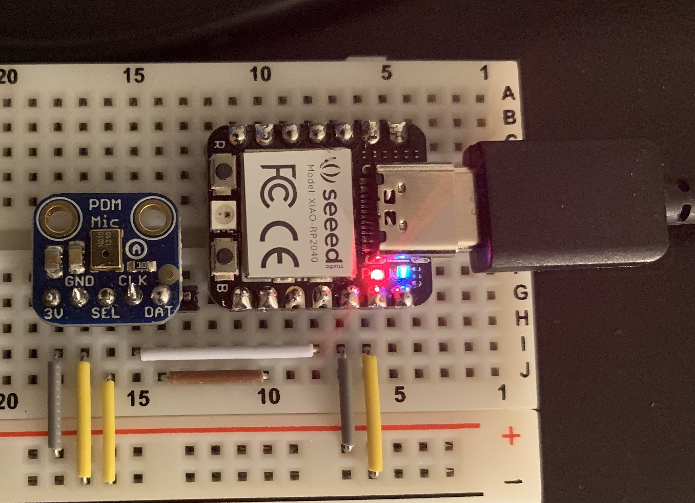

# Remote-Stethoscope

## Communication
https://discord.gg/RNJMYp4RQn

## Data Pipeline 
- Heart
- Microphone
  - filter input frequency range
    - what frequency ranges are of interest?
    - do we want a discrete or analog UI for controlling inputs on the stethoscope?
  - amplify signal if analog mic
  - convert to digital signal if not a digital mic
  - potentially explore using multiple types of microphones and use input concensus to further filter out noise
- microcontroller processes raw input into audio format
- microcontroller streams unencrypted data to PC as a microphone
- PC software encrypts audio stream and sends to doctor in real-time
  - PC software on doctor's end decrypts audio stream and broadcasts to system audio output
- PC software (on user end or doctor's end?) saves an encrypted copy of the recording as an audio file (and sends it to doctor if on user's end)
  - Advantages of user's end file save:
    - Potential for packet loss of done on doctor's end
  - Advantages of doctor's end file save:
    - Doctor can segment the incoming real-time stream based on when the patient switches which body part is being listened to, allowing for an easier time with labeling the saved data for potential data visualization and AI applications

## Instructions
### Setting up a Xiao RP2040 with already compiled code
1. Connect the Xiao RP2040 to your computer via USB-C cable
    - In order to boot the microcontroller into flashable mode, hold down the microcontroller push button labeled "B" from before the connection to the computer happens until after the LED on the microcontroller turns on.
2. To flash a new microcontroller with the software to act as a microphone, copy the file usb_microphone.uf2 into the root directory of the microcontroller.  It should automatically disconnect after this and reboot into a device that the system will refer to as MicNode
3. Connect the Xiao RP2040 to the MEMS digital microphone.  See "./doc/BreadboardCircuit.png" for a demonstration of of how the circuit should appear.
    - The microcontroller and microphone boards should both be soldered to their respective pin headers in order for this to work.
4. Open Audacity, select Microphone (MicNode) as your recording device, begin recording, and confirm that the microphone is recording a clear signal.

### Setting up a development environment
Instructions compiled from: [the ARM developer ecosystem](https://github.com/ArmDeveloperEcosystem/microphone-library-for-pico#building), [the getting started with Raspberry Pi Pico datasheet section 9.2](https://datasheets.raspberrypi.com/pico/getting-started-with-pico.pdf), and from viewers like you.  Thank you.

1. Install the toolchain
   1. Install [the ARM GNU Toolchain](https://developer.arm.com/tools-and-software/open-source-software/developer-tools/gnu-toolchain/downloads).  You will need the arm-none-eabi version.  Download and run the executable.
       - Automated install available [here](https://github.com/M-Nelyubov/Software-Installers/blob/main/applications/install-ArmGnuToolchain.ps1).

   1. Install [CMake](https://cmake.org/download/).
       - Automated install available [here](https://github.com/M-Nelyubov/Software-Installers/blob/main/applications/install-CMake.ps1).

   1. Install [Build tools for Visual Studio 2022](https://visualstudio.microsoft.com/downloads/#build-tools-for-visual-studio-2022).
       - Automated install available [here](https://github.com/M-Nelyubov/Software-Installers/blob/main/applications/install-visualStudioCppToolkit.ps1).
   
   1. Install [Python](https://www.python.org/downloads/windows/).
       - Automated install available [here](https://github.com/M-Nelyubov/Software-Installers/blob/main/applications/install-python.ps1).

   1. Install [Git](https://git-scm.com/download/win).
       - Automated install available [here](https://github.com/M-Nelyubov/Software-Installers/blob/main/applications/install-Git.ps1).
   - This entire collection of installations can be run in one go with [this script](https://github.com/M-Nelyubov/Software-Installers/blob/main/install-StethoscopeStack.ps1).

